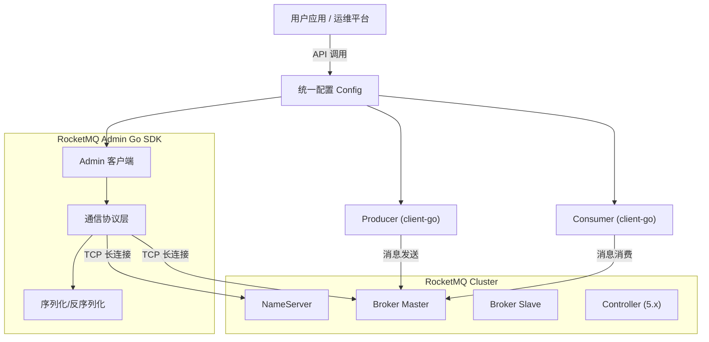

<div align="center">
  
  <h1>🚀 RocketMQ Admin Go</h1>
  <p><strong>专为 Go 语言打造的 Apache RocketMQ 运维管理客户端</strong></p>
  <p>全功能复刻 Java 版 <code>MQAdminExt</code> 能力，与官方 <code>rocketmq-client-go</code> 无缝集成。</p>

  <p>
    <a href="https://pkg.go.dev/github.com/amigoer/rocketmq-admin-go">
      
    </a>
    <a href="https://goreportcard.com/report/github.com/amigoer/rocketmq-admin-go">
      
    </a>
    <a href="LICENSE">
      
    </a>
    
  </p>

  <p>
    官方的 <a href="https://github.com/apache/rocketmq-client-go">rocketmq-client-go</a> 专注于消息的<strong>生产</strong>与<strong>消费</strong>，但在运维管理方面缺乏原生支持。<br>
    本项目作为其<strong>增强包</strong>，提供完整的运维管理能力，并支持<strong>配置共享</strong>。
  </p>

</div>

## ✨ 核心特性

| 模块           | 功能亮点                                                         | 完成度 |
| :------------- | :--------------------------------------------------------------- | :----: |
| **配置共享**   | 与 rocketmq-client-go 无缝集成，**配置一次、两边使用**           |   ✅    |
| **基础运维**   | 集群状态监控、Broker 运行时信息、NameServer 配置管理             |   ✅    |
| **Topic 管理** | 创建/删除 Topic、路由查询、静态 Topic、Topic 权限控制            |   ✅    |
| **消费者管理** | 订阅组管理、消费进度监控、在线客户端查询、**重置消费位点**       |   ✅    |
| **消息操作**   | 消息轨迹查询、**消息直接消费**、死信队列处理、半消息恢复         |   ✅    |
| **权限安全**   | 5.x RBAC ACL + 4.x 旧版 ACL (plain_acl.yml)，白名单/黑名单规则控制 |   ✅    |
| **高级功能**   | KV 配置、Controller 模式管理 (5.x)、**冷数据流控**、RocksDB 调优 |   ✅    |


## 🛠️ 安装

```bash
go get github.com/amigoer/rocketmq-admin-go@latest
```

> 要求 Go 1.25 或更高版本。


## 🚀 快速开始

### 方式一：统一配置（推荐）

**配置一次，同时使用运维接口和消息收发接口：**

```go
package main

import (
    "context"
    "fmt"
    
    admin "github.com/amigoer/rocketmq-admin-go"
    "github.com/apache/rocketmq-client-go/v2/primitive"
    "github.com/apache/rocketmq-client-go/v2/producer"
)

func main() {
    // ========== 配置只写一次 ==========
    config := admin.NewConfig("localhost:9876").
        WithCredentials("admin", "password")

    // ========== 运维操作 ==========
    adminClient, _ := config.NewAdminClient()
    adminClient.Start()
    defer adminClient.Close()

    // 查询集群信息
    clusterInfo, _ := adminClient.ExamineBrokerClusterInfo(context.Background())
    fmt.Printf("集群: %+v\n", clusterInfo)

    // ========== 生产消息 ==========
    p, _ := config.NewProducer(producer.WithRetry(2))
    p.Start()
    defer p.Shutdown()

    res, _ := p.SendSync(context.Background(), &primitive.Message{
        Topic: "test-topic",
        Body:  []byte("Hello RocketMQ!"),
    })
    fmt.Printf("发送成功: %s\n", res.MsgID)
}
```

### 方式二：仅使用运维接口

如果不需要消息收发，可以直接创建 Admin 客户端：

```go
package main

import (
    "context"
    "fmt"
    "log"
    "time"

    admin "github.com/amigoer/rocketmq-admin-go"
)

func main() {
    // 创建 Admin 客户端
    client, err := admin.NewClient(
        admin.WithNameServers([]string{"127.0.0.1:9876"}),
        admin.WithTimeout(5 * time.Second),
    )
    if err != nil {
        log.Fatalf("初始化失败: %v", err)
    }
    defer client.Close()

    if err := client.Start(); err != nil {
        log.Fatalf("启动失败: %v", err)
    }

    // 查询集群信息
    clusterInfo, err := client.ExamineBrokerClusterInfo(context.Background())
    if err != nil {
        log.Fatalf("查询异常: %v", err)
    }

    fmt.Println("🚀 RocketMQ 集群概览:")
    for clusterName, brokerNames := range clusterInfo.ClusterAddrTable {
        fmt.Printf("Cluster: %s\n", clusterName)
        for _, brokerName := range brokerNames {
            brokerData := clusterInfo.BrokerAddrTable[brokerName]
            fmt.Printf("  └─ Broker: %s (Master: %s)\n", brokerName, brokerData.BrokerAddrs["0"])
        }
    }
}
```

更多示例请参考 [examples](./examples) 目录。


## 📝 更多使用示例

### Topic 管理

```go
ctx := context.Background()

// 创建 Topic
topicConfig := admin.TopicConfig{
    TopicName:      "TestTopic",
    ReadQueueNums:  8,
    WriteQueueNums: 8,
    Perm:           6, // 读写权限
}
client.CreateTopic(ctx, "127.0.0.1:10911", topicConfig)

// 查询 Topic 路由信息
routeData, _ := client.ExamineTopicRouteInfo(ctx, "TestTopic")
fmt.Printf("Broker 数量: %d, 队列数量: %d\n", len(routeData.BrokerDatas), len(routeData.QueueDatas))

// 查询 Topic 统计
stats, _ := client.ExamineTopicStats(ctx, "TestTopic")
fmt.Printf("消息队列数量: %d\n", len(stats.OffsetTable))

// 删除 Topic
client.DeleteTopic(ctx, "TestTopic", "DefaultCluster")
```

### Broker 运维

```go
// 获取集群信息，找到 Broker Master 地址
clusterInfo, _ := client.ExamineBrokerClusterInfo(ctx)

for name, brokerData := range clusterInfo.BrokerAddrTable {
    brokerAddr := brokerData.BrokerAddrs["0"] // Master
    fmt.Printf("Broker: %s (%s)\n", name, brokerAddr)

    // 获取 Broker 运行时统计
    kvTable, _ := client.FetchBrokerRuntimeStats(ctx, brokerAddr)
    fmt.Printf("版本: %s\n", kvTable.Table["brokerVersionDesc"])

    // 获取 Broker 配置
    config, _ := client.GetBrokerConfig(ctx, brokerAddr)
    fmt.Printf("brokerName: %s, brokerId: %s\n", config["brokerName"], config["brokerId"])
}
```

### 消费者管理

```go
// 创建订阅组
groupConfig := admin.SubscriptionGroupConfig{
    GroupName:      "TestConsumerGroup",
    ConsumeEnable:  true,
    RetryQueueNums: 1,
    RetryMaxTimes:  16,
}
client.CreateSubscriptionGroup(ctx, "127.0.0.1:10911", groupConfig)

// 查询消费统计
consumeStats, _ := client.ExamineConsumeStats(ctx, "TestConsumerGroup")
fmt.Printf("消费 TPS: %.2f, 队列数量: %d\n", consumeStats.ConsumeTps, len(consumeStats.OffsetTable))

// 查询消费者连接
connInfo, _ := client.ExamineConsumerConnectionInfo(ctx, "TestConsumerGroup")
fmt.Printf("连接数: %d, 消费类型: %s\n", len(connInfo.ConnectionSet), connInfo.ConsumeType)

// 重置消费位点（重置到 1 小时前）
timestamp := (time.Now().Unix() - 3600) * 1000
offsets, _ := client.ResetOffsetByTimestamp(ctx, "TestTopic", "TestConsumerGroup", timestamp, false)
fmt.Printf("重置队列数: %d\n", len(offsets))
```

### 消息查询

```go
topic := "TestTopic"

// 按 Key 查询消息
beginTime := time.Now().Add(-24 * time.Hour).UnixMilli()
endTime := time.Now().UnixMilli()
msgs, _ := client.QueryMessage(ctx, topic, "Order-1001", 32, beginTime, endTime)
fmt.Printf("找到消息数: %d\n", len(msgs))

// 按 ID 查看消息详情
msg, _ := client.ViewMessage(ctx, topic, msgs[0].MsgId)
fmt.Printf("Topic: %s, QueueId: %d, BornHost: %s\n", msg.Topic, msg.QueueId, msg.BornHost)

// 查询消费队列
qData, _ := client.QueryConsumeQueue(ctx, "127.0.0.1:10911", topic, 0, 0, 10, "DefaultGroup")
fmt.Printf("获取条目数: %d\n", len(qData))
```

### ACL 权限管理（5.x RBAC）

```go
brokerAddr := "127.0.0.1:10911"

// 创建用户
user := admin.UserInfo{
    Username:   "test_user",
    Password:   "12345678",
    UserType:   "NORMAL",
    UserStatus: "OPEN",
}
client.UpdateUser(ctx, brokerAddr, user)

// 配置 ACL 权限
acl := admin.AclInfo{
    Subject: "test_user",
    Policies: []admin.AclPolicy{
        {
            Resource: "TestTopic",
            Actions:  []string{"PUB", "SUB"},
            Effect:   "ALLOW",
            Decision: "ALLOW",
        },
    },
}
client.UpdateAcl(ctx, brokerAddr, acl)

// 列出 ACL 规则
acls, _ := client.ListAcl(ctx, brokerAddr)
for _, a := range acls.Acls {
    fmt.Printf("主体: %s, 策略数: %d\n", a.Subject, len(a.Policies))
}
```

### ACL 权限管理（4.x 旧版 plain_acl.yml）

```go
brokerAddr := "127.0.0.1:10911"

// 创建/更新 plain access config
config := admin.PlainAccessConfig{
    AccessKey:          "rocketmq_ak",
    SecretKey:          "rocketmq_sk",
    Admin:              false,
    DefaultTopicPerm:   "DENY",
    DefaultGroupPerm:   "SUB",
    TopicPerms:         []string{"TopicA=PUB|SUB", "TopicB=PUB"},
    GroupPerms:         []string{"GroupA=SUB"},
    WhiteRemoteAddress: "192.168.1.*",
}
client.UpdatePlainAccessConfig(ctx, brokerAddr, config)

// 删除 plain access config
client.DeletePlainAccessConfig(ctx, brokerAddr, "rocketmq_ak")

// 查询 Broker 集群 ACL 版本信息
aclInfo, _ := client.GetBrokerClusterAclInfo(ctx, brokerAddr)
fmt.Printf("ACL 版本: %s\n", aclInfo.AclConfigDataVersion)

// 更新全局白名单
client.UpdateGlobalWhiteAddrsConfig(ctx, brokerAddr, []string{"10.0.0.*", "192.168.*"}, "")
```


## 📊 接口覆盖统计

本项目全面复刻 Java 版 `MQAdminExt` 的 **119 个接口**：

| 分类            | 接口数量 | 核心 (P0) | 常用 (P1) | 进阶 (P2) | 高级 (P3) |
| --------------- | :------: | :-------: | :-------: | :-------: | :-------: |
| 生命周期管理    |    2     |     2     |     0     |     0     |     0     |
| Broker 管理     |    12    |     1     |     5     |     6     |     0     |
| Topic 管理      |    20    |     5     |     9     |     6     |     0     |
| 消费者组管理    |    26    |     5     |    11     |    10     |     0     |
| 生产者管理      |    2     |     0     |     2     |     0     |     0     |
| 集群管理        |    5     |     2     |     2     |     1     |     0     |
| 消息操作        |    7     |     0     |     3     |     4     |     0     |
| Offset 管理     |    7     |     1     |     4     |     1     |     1     |
| KV 配置管理     |    6     |     0     |     0     |     6     |     0     |
| ACL 权限管理 (5.x) |   10  |     0     |    10     |     0     |     0     |
| ACL 权限管理 (4.x) |    4  |     0     |     4     |     0     |     0     |
| Controller 管理 |    5     |     0     |     0     |     5     |     0     |
| 高级功能        |    13    |     0     |     0     |     5     |     8     |
| **总计**        | **119**  |  **16**   |  **50**   |  **44**   |   **9**   |

> 完整接口对照表请参考 [docs/interfaces.md](./docs/interfaces.md)。


## 🔧 协议实现

本项目**完全使用 Go 标准库** (`net` + `encoding/binary` + `encoding/json`) 原生实现了 RocketMQ Remoting 协议，零第三方网络库依赖：

```text
+----------------+----------------+---------------------+----------------+
|  Total Length   |  Header Length |    Header Data      |      Body      |
|    (4 Bytes)   |    (4 Bytes)   |  (JSON Serialized)  |  (Byte Array)  |
+----------------+----------------+---------------------+----------------+
```

> 详细协议解析请参考 [docs/rocketmq_protocol.md](./docs/rocketmq_protocol.md)。


## 🔌 与 rocketmq-client-go 集成

本项目设计为 `rocketmq-client-go` 的**增强包**，通过统一配置工厂实现配置共享：

```go
// 统一配置
config := admin.NewConfig("localhost:9876").
    WithCredentials("accessKey", "secretKey").
    WithTimeout(10 * time.Second)

// 创建 Admin 运维客户端
adminClient, _ := config.NewAdminClient()

// 创建 Producer
producer, _ := config.NewProducer()

// 创建 Push Consumer
pushConsumer, _ := config.NewPushConsumer(consumer.WithGroupName("my-group"))

// 创建 Pull Consumer
pullConsumer, _ := config.NewPullConsumer()
```

**工厂方法：**

| 方法                       | 返回类型                | 说明            |
| -------------------------- | ----------------------- | --------------- |
| `NewAdminClient()`         | `*admin.Client`         | 运维管理客户端  |
| `NewProducer(opts...)`     | `rocketmq.Producer`     | 消息生产者      |
| `NewPushConsumer(opts...)` | `rocketmq.PushConsumer` | Push 模式消费者 |
| `NewPullConsumer(opts...)` | `rocketmq.PullConsumer` | Pull 模式消费者 |


## 🏗️ 架构概览




## 📚 技术文档

- [接口对照表](./docs/interfaces.md): 详细列出了所有支持的 Admin 接口及其实现状态。
- [协议实现解析](./docs/rocketmq_protocol.md): 深入解析 RocketMQ Remoting 协议的纯 Go 实现原理。


## 🤝 贡献与支持

欢迎提交 [Issue](https://github.com/amigoer/rocketmq-admin-go/issues) 或 [Pull Request](https://github.com/amigoer/rocketmq-admin-go/pulls) 改进本项目。

1. Fork 本仓库
2. 创建特性分支 (`git checkout -b feature/AmazingFeature`)
3. 提交更改 (`git commit -m 'Add some AmazingFeature'`)
4. 推送到分支 (`git push origin feature/AmazingFeature`)
5. 提交 Pull Request


## 📄 许可证

本项目采用 [Apache-2.0](./LICENSE) 许可证。

Copyright (c) 2026 Amigoer
