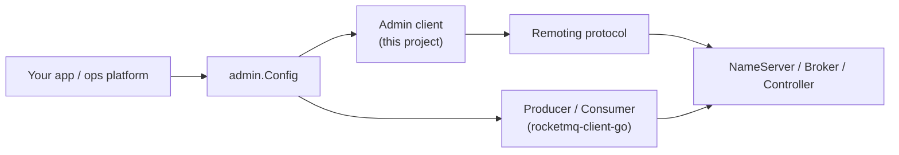

<div align="center">
  
  <h1>RocketMQ Admin Go</h1>
  <p><strong>An admin client for Apache RocketMQ, written in Go</strong></p>

  <p>
    <a href="https://pkg.go.dev/github.com/amigoer/rocketmq-admin-go">
      
    </a>
    <a href="https://goreportcard.com/report/github.com/amigoer/rocketmq-admin-go">
      
    </a>
    <a href="LICENSE">
      
    </a>
    
  </p>

  <p><b>English</b> | <a href="README_zh.md">简体中文</a></p>
</div>

## What it is

The official [rocketmq-client-go](https://github.com/apache/rocketmq-client-go) covers **producing and consuming** messages, but stops there. Creating a topic, checking how far a consumer group has fallen behind, resetting an offset, granting a permission — from Go, all of that has meant shelling out to the Java `mqadmin`.

This project fills in the other half. It reimplements the admin surface of Java's `MQAdminExt` in Go, exposing 106 methods on `Client`, and it **shares a single configuration** with `rocketmq-client-go`.


```mermaid
graph LR
    App["Your app / ops platform"] --> Config["admin.Config"]
    Config --> Admin["Admin client<br/>(this project)"]
    Config --> PC["Producer / Consumer<br/>(rocketmq-client-go)"]
    Admin --> Remoting["Remoting protocol"]
    Remoting --> Cluster["NameServer / Broker / Controller"]
    PC --> Cluster
```

## Features

| Area              | What it covers                                                                     |
| :---------------- | :--------------------------------------------------------------------------------- |
| **Shared config** | One `Config` produces both the admin client and a Producer / Consumer              |
| **Cluster ops**   | Cluster topology, Broker runtime stats and configuration, NameServer configuration |
| **Topics**        | Create and delete, route and stats queries, static topics, read/write permissions  |
| **Consumers**     | Subscription groups, consume progress and backlog, online clients, offset reset    |
| **Messages**      | Query by key, id or time range; consume tracking, direct consumption, half messages |
| **Security**      | 5.x RBAC (users and ACL rules), 4.x `plain_acl.yml`, global IP allowlist           |
| **Advanced**      | KV config, Controller management (5.x), cold-data throttling, RocksDB tuning       |

Coming from the Java admin API? [docs/interfaces.md](./docs/interfaces.md) maps
`MQAdminExt` onto this one. The full method list is on
[pkg.go.dev](https://pkg.go.dev/github.com/amigoer/rocketmq-admin-go#Client).

## Install

```bash
go get github.com/amigoer/rocketmq-admin-go@latest
```

Requires Go 1.25 or newer.

## Quick start

```go
package main

import (
	"context"
	"fmt"
	"log"

	admin "github.com/amigoer/rocketmq-admin-go"
)

func main() {
	// Configure once
	cfg := admin.NewConfig("127.0.0.1:9876").
		WithCredentials("accessKey", "secretKey")

	client, err := cfg.NewAdminClient()
	if err != nil {
		log.Fatal(err)
	}
	if err := client.Start(); err != nil {
		log.Fatal(err)
	}
	defer client.Close()

	cluster, err := client.ExamineBrokerClusterInfo(context.Background())
	if err != nil {
		log.Fatal(err)
	}
	for name, brokers := range cluster.ClusterAddrTable {
		fmt.Printf("%s: %v\n", name, brokers)
	}

	// The same cfg hands you rocketmq-client-go's messaging clients
	// producer, _ := cfg.NewProducer()
	// consumer, _ := cfg.NewPushConsumer(consumer.WithGroupName("my-group"))
}
```

If you do not need to send or receive messages, skip `Config` and build the client directly:

```go
client, err := admin.NewClient(
	admin.WithNameServers([]string{"127.0.0.1:9876"}),
	admin.WithTimeout(5*time.Second),
)
```

Runnable examples grouped by topic are in [examples/](./examples); per-method documentation is on [pkg.go.dev](https://pkg.go.dev/github.com/amigoer/rocketmq-admin-go).

## Design notes

**No third-party networking.** The RocketMQ Remoting protocol is implemented directly on the standard library (`net` + `encoding/binary` + `encoding/json`):

```text
+----------------+----------------+---------------------+----------------+
|  Total Length  |  Header Length |     Header Data     |      Body      |
|    (4 Bytes)   |    (4 Bytes)   |  (JSON Serialized)  |  (Byte Array)  |
+----------------+----------------+---------------------+----------------+
```

**Both 4.x and 5.x.** The places where the two generations diverge are covered on both sides: 5.x brings the RBAC permission model and Controller mode, while 4.x keeps the older `plain_acl.yml` ACL.

**Works through a Proxy.** A RocketMQ 5.x Proxy must know the target Broker's name before it can forward a request. The client learns Broker names from route and cluster information and fills in the `bname` header itself, so callers never need to know whether they are talking to a Proxy or a Broker.

**Tolerates non-standard JSON.** RocketMQ answers with JSON no standard parser accepts — unquoted numeric keys, Fastjson maps whose keys are objects. Responses are repaired before unmarshalling.

Protocol details are in [docs/rocketmq_protocol.md](./docs/rocketmq_protocol.md).

## Contributing

[Issues](https://github.com/amigoer/rocketmq-admin-go/issues) and [pull requests](https://github.com/amigoer/rocketmq-admin-go/pulls) are welcome.

The integration tests need a reachable RocketMQ cluster:

```bash
ROCKETMQ_NAMESRV_ADDR=127.0.0.1:9876 go test ./...
```

They skip themselves when no cluster is reachable; `ROCKETMQ_TEST_SKIP=true` forces the skip.

## License

[Apache-2.0](./LICENSE) — Copyright (c) 2026 Amigoer
