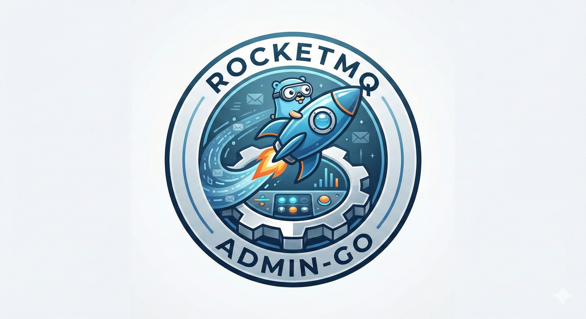
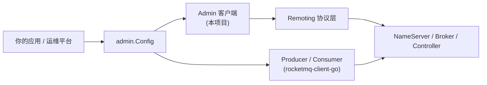

<div align="center">
  
  <h1>RocketMQ Admin Go</h1>
  <p><strong>Apache RocketMQ 的 Go 运维管理客户端</strong></p>

  <p>
    <a href="https://pkg.go.dev/github.com/amigoer/rocketmq-admin-go">
      
    </a>
    <a href="https://goreportcard.com/report/github.com/amigoer/rocketmq-admin-go">
      
    </a>
    <a href="LICENSE">
      
    </a>
    
  </p>

  <p><a href="README.md">English</a> | <b>简体中文</b></p>
</div>

## 这是什么

官方的 [rocketmq-client-go](https://github.com/apache/rocketmq-client-go) 解决了消息的**生产和消费**，但没有提供运维管理能力 —— 建 Topic、查消费进度、重置位点、管权限这些事，在 Go 里一直只能靠拼 shell 调 Java 版 `mqadmin`。

本项目补上这一半：把 Java 版 `MQAdminExt` 的运维接口用 Go 重新实现，`Client` 上提供 106 个方法，并与 `rocketmq-client-go` **共用同一份配置**。



## 特性

| 模块           | 能力                                                               |
| :------------- | :----------------------------------------------------------------- |
| **配置共享**   | 一份 `Config` 同时产出 Admin 客户端与 Producer / Consumer          |
| **集群运维**   | 集群拓扑、Broker 运行时统计与配置、NameServer 配置                 |
| **Topic 管理** | 创建 / 删除、路由与统计查询、静态 Topic、读写权限控制              |
| **消费者管理** | 订阅组增删改查、消费进度与积压、在线客户端、按时间戳重置位点       |
| **消息操作**   | 按 Key / ID / 时间范围查询、消费轨迹、直接消费、半消息恢复         |
| **权限安全**   | 5.x RBAC（用户与 ACL 规则）+ 4.x `plain_acl.yml`、全局 IP 白名单   |
| **高级功能**   | KV 配置、Controller 管理（5.x）、冷数据流控、RocksDB 调优          |

完整的接口对照表见 [docs/interfaces.md](./docs/interfaces.md)。

## 安装

```bash
go get github.com/amigoer/rocketmq-admin-go@latest
```

需要 Go 1.25 或更高版本。

## 快速开始

```go
package main

import (
	"context"
	"fmt"
	"log"

	admin "github.com/amigoer/rocketmq-admin-go"
)

func main() {
	// 配置只写一次
	cfg := admin.NewConfig("127.0.0.1:9876").
		WithCredentials("accessKey", "secretKey")

	client, err := cfg.NewAdminClient()
	if err != nil {
		log.Fatal(err)
	}
	if err := client.Start(); err != nil {
		log.Fatal(err)
	}
	defer client.Close()

	cluster, err := client.ExamineBrokerClusterInfo(context.Background())
	if err != nil {
		log.Fatal(err)
	}
	for name, brokers := range cluster.ClusterAddrTable {
		fmt.Printf("%s: %v\n", name, brokers)
	}

	// 同一份 cfg 直接产出 rocketmq-client-go 的收发客户端
	// producer, _ := cfg.NewProducer()
	// consumer, _ := cfg.NewPushConsumer(consumer.WithGroupName("my-group"))
}
```

不需要收发消息时，也可以跳过 `Config` 直接建客户端：

```go
client, err := admin.NewClient(
	admin.WithNameServers([]string{"127.0.0.1:9876"}),
	admin.WithTimeout(5*time.Second),
)
```

按主题划分的可运行示例在 [examples/](./examples) 目录，逐个接口的用法见 [pkg.go.dev](https://pkg.go.dev/github.com/amigoer/rocketmq-admin-go)。

## 设计要点

**协议层零第三方依赖。** RocketMQ Remoting 协议用标准库直接实现（`net` + `encoding/binary` + `encoding/json`），没有引入任何网络框架：

```text
+----------------+----------------+---------------------+----------------+
|  Total Length  |  Header Length |     Header Data     |      Body      |
|    (4 Bytes)   |    (4 Bytes)   |  (JSON Serialized)  |  (Byte Array)  |
+----------------+----------------+---------------------+----------------+
```

**同时支持 4.x 和 5.x。** 两代差异较大的部分都做了覆盖：5.x 的 RBAC 权限模型与 Controller 模式，4.x 基于 `plain_acl.yml` 的旧版 ACL。

**能穿过 Proxy。** RocketMQ 5.x 的 Proxy 转发请求前需要知道目标 Broker 名称，客户端会从路由和集群信息中自动学习并补上 `bname` 请求头，调用方无需关心连的是 Proxy 还是 Broker。

**响应容错。** RocketMQ 会返回若干非标准 JSON（无引号的数字键、Fastjson 的对象键 Map），解析前统一做了修正。

协议细节见 [docs/rocketmq_protocol.md](./docs/rocketmq_protocol.md)。

## 贡献

欢迎提交 [Issue](https://github.com/amigoer/rocketmq-admin-go/issues) 或 [Pull Request](https://github.com/amigoer/rocketmq-admin-go/pulls)。

集成测试需要一个可达的 RocketMQ 集群：

```bash
ROCKETMQ_NAMESRV_ADDR=127.0.0.1:9876 go test ./...
```

没有集群时会自动跳过，也可以用 `ROCKETMQ_TEST_SKIP=true` 强制跳过。

## 许可证

[Apache-2.0](./LICENSE) — Copyright (c) 2026 Amigoer
