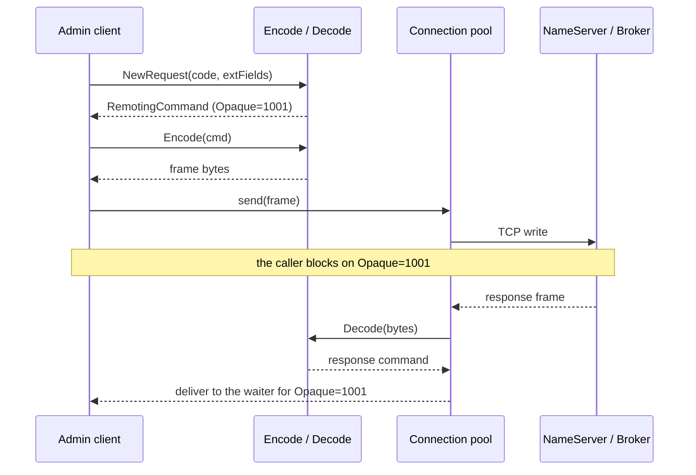

# The RocketMQ Remoting protocol, implemented on the standard library

RocketMQ's transport is a custom binary protocol, served by Netty on the broker
side. To stay dependency-free, this project reimplements it directly on the Go
standard library — `net`, `encoding/binary` and `encoding/json`, nothing else.

This page describes the wire format and how it is encoded and decoded here. The
code lives in [`protocol/remoting`](../protocol/remoting).

## 1. Frame layout

```text
+----------------+----------------+---------------------+----------------+
|  Total Length  |  Header Length |     Header Data     |      Body      |
|    (4 Bytes)   |    (4 Bytes)   |  (JSON or binary)   |  (Byte Array)  |
+----------------+----------------+---------------------+----------------+
```

**Total Length** — `int32`, big endian. The length of everything that follows:
the header-length word, the header, and the body. This is the field that makes
the stream self-delimiting over TCP.

**Header Length and Serialize Type** — one `int32`, big endian, carrying two
values at once:

- low 24 bits: the length of the header
- high 8 bits: the serialization type — `0` for JSON, `1` for RocketMQ's own
  compact binary format. Requests always go out as JSON; both are decoded,
  because a response is encoded by whoever produced it. A Broker relaying a
  Java client's answer — `GET_CONSUMER_RUNNING_INFO` is the one that matters —
  hands back a binary header.

**Header Data** — `RemotingCommand`: request code, language, version, request
id (`Opaque`) and the header fields (`ExtFields`), in whichever of the two
encodings the type byte names.

**Body** — raw bytes. The payload: message content, route data, and so on.

## 2. The command

```go
// RemotingCommand is a single protocol frame, request or response.
type RemotingCommand struct {
	Code      int               `json:"code"`
	Language  string            `json:"language"`
	Version   int               `json:"version"`
	Opaque    int32             `json:"opaque"` // request id, echoed in the response
	Flag      int               `json:"flag"`   // RPCType or OnewayRPC, plus the response bit
	Remark    string            `json:"remark"`
	ExtFields map[string]string `json:"extFields"` // request header fields

	// Body is sent after the header, so it is never part of the header JSON.
	Body []byte `json:"-"`
}
```

Note the `json:"-"` on `Body`: the body travels after the header on the wire, so
it must never end up inside the header JSON.

## 3. Encoding

```go
// Encode serialises the command into a length-prefixed frame.
func (cmd *RemotingCommand) Encode() ([]byte, error) {
	headerBytes, err := json.Marshal(cmd)
	if err != nil {
		return nil, err
	}

	headerLen := len(headerBytes)
	bodyLen := len(cmd.Body)
	totalLen := 4 + headerLen + bodyLen

	buf := make([]byte, 4+totalLen)

	binary.BigEndian.PutUint32(buf[0:4], uint32(totalLen))

	// Header length and serialize type share one 32-bit word.
	binary.BigEndian.PutUint32(buf[4:8], uint32(headerLen)|(uint32(JSONSerializeType)<<24))

	copy(buf[8:8+headerLen], headerBytes)

	if bodyLen > 0 {
		copy(buf[8+headerLen:], cmd.Body)
	}

	return buf, nil
}
```

The one subtle line is the second `PutUint32`: the header length and the
serialize type share a single 32-bit word, so the type is shifted into the top
byte rather than written separately.

## 4. Decoding

```go
// Decode parses a frame whose leading total-length word has already been read.
func Decode(data []byte) (*RemotingCommand, error) {
	if len(data) < 4 {
		return nil, ErrInvalidData
	}

	// The top byte holds the serialize type; the rest is the header length.
	word := binary.BigEndian.Uint32(data[0:4])
	headerLen := int(word & 0x00FFFFFF)

	if len(data) < 4+headerLen {
		return nil, ErrInvalidData
	}

	var (
		cmd *RemotingCommand
		err error
	)
	switch byte(word >> 24) {
	case JSONSerializeType:
		cmd = &RemotingCommand{}
		err = json.Unmarshal(data[4:4+headerLen], cmd)
	case RocketMQSerializeType:
		cmd, err = decodeBinaryHeader(data[4 : 4+headerLen])
	default:
		return nil, ErrUnknownSerializeType
	}
	if err != nil {
		return nil, err
	}

	if len(data) > 4+headerLen {
		cmd.Body = data[4+headerLen:]
	}

	return cmd, nil
}
```

`Decode` expects the leading total-length word to have already been consumed by
the read loop, which needs it to know how many bytes to read. Masking with
`0x00FFFFFF` leaves the header length; the byte that was masked off decides
which of the two header encodings to read.

The binary one is fixed-order fields, big endian, with the two variable parts
length-prefixed:

```text
code int16 | language int8 | version int16 | opaque int32 | flag int32 |
remarkLen int32 + remark | extFieldsLen int32 + extFields
```

`extFields` is itself a run of `keyLen int16 + key + valueLen int32 + value`.
Getting this wrong is invisible rather than loud: the read loop cannot match a
header it failed to parse to any waiting request, so the caller sits there until
its context expires.

## 5. Request and response flow

Requests and responses are matched by `Opaque`, an atomically incremented
counter. A single connection can therefore have many requests outstanding: the
read loop dispatches each response to whoever is waiting on that id.



Step by step:

1. **Connect** — `net.DialTimeout` opens the TCP connection; the pool keeps one
   per address.
2. **Build** — create a `RemotingCommand`, set its `Code` (for example
   `GetBrokerClusterInfo = 106`), and take an `Opaque` via `atomic.AddInt32`.
3. **Send** — `Encode()` produces the frame, `conn.Write` puts it on the wire.
4. **Read** — a background loop reads 4 bytes for the total length, then that
   many bytes, decodes them, and hands the result to the channel registered
   under the response's `Opaque`.

## 6. Two things the wire needs beyond the frame

**RocketMQ does not always answer with valid JSON.** Numeric map keys arrive
unquoted, and Fastjson serializes maps whose keys are objects in a form no
standard parser accepts. Responses are repaired before unmarshalling — see
[`json_fix.go`](../json_fix.go).

**A 5.x Proxy needs to know where to forward.** It requires a `bname` header
naming the target Broker and rejects requests without one. The client learns
Broker names from route and cluster responses and fills the header in itself —
see [`brokername.go`](../brokername.go).

## 7. ACL 1.0 request signing

A Broker with `aclEnable=true` authenticates every admin request from two
header fields the client adds: `AccessKey`, and a `Signature` over the rest of
the request — see [`protocol/remoting/acl.go`](../protocol/remoting/acl.go).

The signed content is every header field except `Signature`, sorted by field
name, values concatenated with no separator and no names, with the body
appended. `PlainAccessValidator` rebuilds exactly that from the `extFields` map
it received and compares. The digest is HMAC-SHA1 under the secret key,
Base64-encoded.

Two consequences of the Broker rebuilding the content from what it *received*:

**Sign last.** Any field added after signing is one the Broker includes and the
client did not, so the two contents differ and the comparison fails. `bname` is
the one that bites, because it is filled in per Broker rather than by the
caller — which also means a command sent to a second Broker has to be signed
again.

**A signature that verifies is not proof the client signs correctly.**
`PlainPermissionManager.validate` matches the global whitelist first and
returns before it looks at any signature, so on a cluster whose
`globalWhiteRemoteAddresses` covers the caller, wrong credentials and no
credentials both work. Test against a whitelist that covers nobody — and note
that an *empty* list is not that: the update request carries the list as one
comma-separated string, and the empty string is read back as RocketMQ's null
strategy, which matches every caller.
